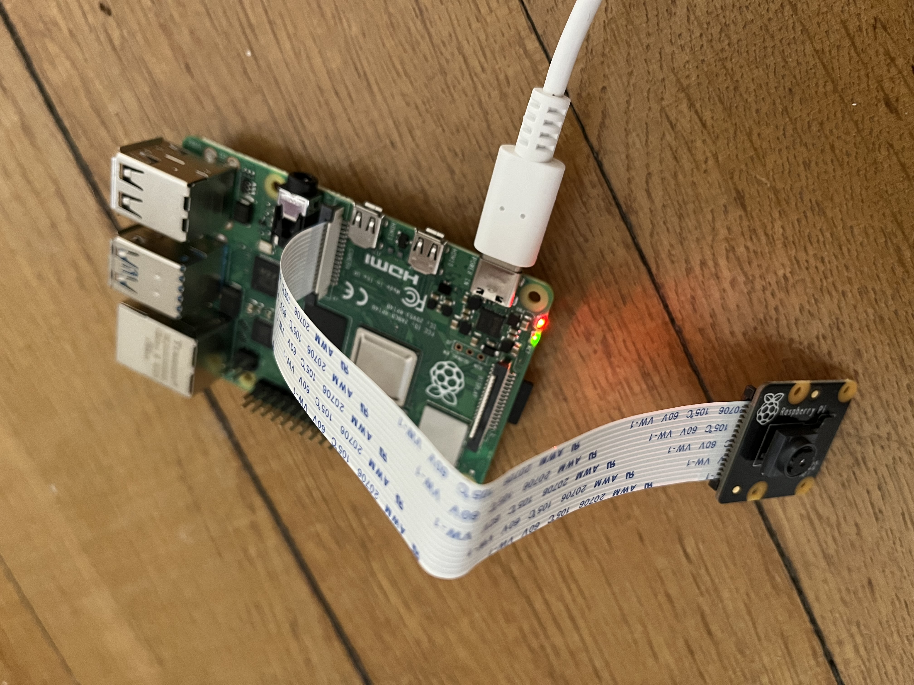

# Setup instructions for the Raspberry Pi

## Prerequisites

- Raspberry Pi 4 (or other compatible Raspberry Pi model)
- Raspberry Pi OS
- SD card (8GB or larger recommended)
- Micro-USB power supply
- Laptop


## Step 1: Flashing the SD Card with Raspberry Pi OS

1. **Download the Raspberry Pi Imager**:  
   Visit the [Raspberry Pi Imager page](https://www.raspberrypi.org/software/) and download the imager for your OS.

2. **Install the Raspberry Pi OS**:  
   - Insert the SD card into your computer.
   - Open the Raspberry Pi Imager and select the Raspberry Pi device that you have, the OS (I recommend 64 bit) that you want to use, and the SD card, and click **Next**.

3. **Edit Settings Before Flashing**:  
   - Before starting the flashing process, click on the **Edit** button on the left
   - Enable **SSH** to allow remote access.
   - Set your **username** and **password** for the Pi (remember these).
   - Configure your **Wi-Fi** settings:  
     - Enter your **Wi-Fi network name (SSID)** and **password**.
     - Set the correct **country code** to ensure proper Wi-Fi operation.

4. **Complete the Flashing**:  
   After you have set everything up, proceed with flashing the SD card. Once the flashing process is complete, eject and remove the SD card from your computer.


## Step 2: Connect Hardware
1. **Insert SD card and Camera**:
   - Before plugging the Raspberry Pi into the power source, insert the the SD card and camera module
   - Make sure to plug the camera ribbon into the "camera" slot rather than the "display" slot, and in the correct pin orientation:




   - Connect the Raspberry Pi to a power source and wait for the boot process to complete.

## Step 3: Set Up SSH Access (for headless setup)
1. **Find the Pi’s IP Address**:  
   - Make sure your client (e.g. desktop/laptop) is on the same Wi-Fi network as the Raspberry Pi host.
   - If the Raspberry Pi is connected to a monitor (e.g. for initial setup), the device should tell you its IP address once it is fully booted.
   - If no monitor is connected, use a network scanner like `nmap` (download for windows) to find the IP address assigned to the Raspberry Pi.
   - Once nmap is installed, open powershell on the client and type in the following  to identify devices on the local network:

   ```bash
   nmap -sn 192.168.1.0/24
   ```

2. **SSH into the Raspberry Pi**:  
   - Once you've identified the IP address for the Raspberry Pi, run the following command to SSH into your Raspberry Pi:

   ```bash
   ssh <username>@<your_pi_ip>
   ```

   - Enter the password that you specified during the flashing process.


## Step 4: Test camera (optional)

1. **Update the System**:  
   - SSH into the host and run the following commands to ensure your system is up-to-date:
   
   ```bash
   sudo apt update
   sudo apt upgrade
   sudo reboot
   ```

2. **Test the Camera**
   - Ensure the camera module is properly connected to the Raspberry Pi via the camera slot (CSI connector).
   - Check for physical issues like loose ribbons or incorrect orientation.
   - Install `libcamera` tools:
   
   ```bash
   sudo apt install libcamera-apps
   ```

   - Capture a test image/video (10 sec):

   ```bash
   libcamera-jpeg -o test.jpg
   ```

   ```bash
   libcamera-vid -t 10000 -o test.h264
   ```

   - If using a headless setup like me, transfer the test image (`test.jpg`) or video (`test.h264`) to your computer using the `scp` (secure copy) command.
   - Open a new terminal or PowerShell and type the following commands (/remote/path/to/file/ should be something like "/home/<username>/"):

   ```bash
   scp username@host:</remote/path/to/file/>test.jpg </local/path/to/destination/>test.jpg .
   scp username@host:</remote/path/to/file/>test.h264 </local/path/to/destination/>test.h264 .
   ```

   - You will get prompted for the Raspberry Pi password again.
   - View test image and video on the client to make sure the video is capturing frames properly
