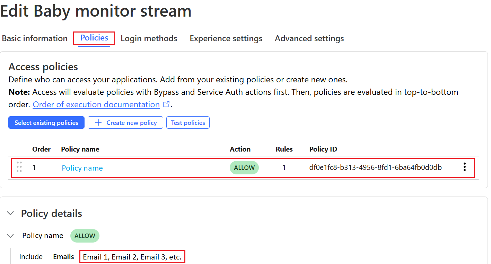

# Setting Up Cloudflare Tunnel for Raspberry Pi Video Streaming

This guide explains how to set up a **Cloudflare Tunnel** to make the Raspberry Pi **video stream accessible over the internet** without exposing a local network. 

---

## **Step 1: Create a Cloudflare Account**
1. Go to **[Cloudflare](https://dash.cloudflare.com/)** and sign up.

2. To make things easier, I also purchased my own domain name for ~$4 for 12 months. If you dont want to pay, you can also stream to a new website everytime you start, but I wanted a permanent domain name that I could password protect and share with family.


Allegedly, CloudFlare also offers free domains, but I couldnt figure this out. If you purchase a domain name with CloudFlare, I would do it now as you will need to connect it to your account for later steps. I also found another [blog](https://dev.to/omarcloud20/a-free-cloudflare-tunnel-running-on-a-raspberry-pi-1jid) that setup a free domain on Freenom, but I got impatient and figured $4 was worth saving another headache :).

---

## **Step 2: Install and Build Dependencies**
SSH into your Raspberry Pi and install Cloudflare's tunnel service:

```bash
sudo apt-get install curl lsb-release
curl -L https://pkg.cloudflare.com/cloudflare-main.gpg | sudo tee /usr/share/keyrings/cloudflare-archive-keyring.gpg >/dev/null
echo "deb [signed-by=/usr/share/keyrings/cloudflare-archive-keyring.gpg] https://pkg.cloudflare.com/cloudflared $(lsb_release -cs) main" | sudo tee  /etc/apt/sources.list.d/cloudflared.list
sudo apt-get update
sudo apt-get install -y cloudflared
```

---

## **Step 3: Authenticate and Create a Tunnel

1. Log in to CloudFlare
```bash
cloudflared tunnel login
```

If using a headless setup like me, this will print out a login link, similar to that below:

```bash
A browser window should have opened at the following URL:

https://dash.cloudflare.com/argotunnel?aud=&callback=https%3A%2F%2Flogin.cloudflareaccess.orgXXXXXXXXXXXXXXXXXXXXXXXXXXXXXX

If the browser failed to open, please visit the URL above directly in your browser.
```

You should copy and paste this link on another computer and login (if you havent done so already). This will take you to a screen like below where you should select your domain that you previously created.


Once connected, you should receive a message like the one below notifying you that the ~/.cloudflared/cert.pem file has been created.

```bash
You have successfully logged in.
If you wish to copy your credentials to a server, they have been saved to:
/home/<username>/.cloudflared/cert.pem
```

2. Create a new tunnel

```bash
cloudflared tunnel create your-tunnel-name
```

This will generate a unique tunnel ID (UUID) that will be specified in the output:

```bash
Tunnel credentials written to /home/<username>/.cloudflared/UUID.json. cloudflared chose this file based on where your origin certificate was found. Keep this file secret. To revoke these credentials, delete the tunnel.

Created tunnel your-tunnel-name with id UUID
```

You can also view the tunnel and its UUID by running the following:

```bash
cloudflared tunnel list
```

You should also see this tunnel in your CloudFlare Zero Trust online account. To do this, first navigate to Zero Trust, and then to your tunnel list:

<p align="center">
    
    
</p>

---

## **Step 4: Configure the Tunnel and DNS**

1. Create and edit the CloudFlare Tunnel configuration file:
```bash
nano ~/.cloudflared/config.yml
```

2. Make sure that your config.yml file looks like that below. Be sure to replace "your-tunnel-id", "username", and "domain-name" with those you have created/set up.

```json
tunnel: your-tunnel-id
credentials-file: /home/<username>/.cloudflared/your-tunnel-id.json

ingress:
  - hostname: domain-name
    service: http://localhost:5000
    originRequest:
      connectTimeout: 30s
      noTLSVerify: true
      keepAliveTimeout: 60s
  - service: http_status:404
```

3. Route the tunnel to your domain's DNS
```bash
cloudflared tunnel route dns tunnel-name domain-name
```

You should see an output similar to that below:

```bash
2025-02-19T08:53:00Z INF Added CNAME domain-name which will route to this tunnel tunnelID=TUNNEL ID
```

This CNAME record type will also now appear in your CloudFlare account:


---

## **Step 5: Start the Tunnel and Stream**

```bash
cloudflared tunnel run your-tunnel-name & python3 Raspberry-Pi-Baby-Monitor/src/stream_LED_cloudflare.py &
```

You should now be able to see the stream on both your local Wi-Fi-connected devices at "http://<your_pi_ip>:5000" and non-local devices at your "domain-name".

---

## **Step 6: Add Password Protection (optional)**
Since these domain names are public, it makes sense to add password protection so that only authorized individuals can access the stream. You can easily do this on the CloudFlare Zero Trust website:

First create an application:


Then, associate your domain name, create an "allow" access policy with specified emails, and select the login method of "One-time PIN" (make sure the "Instant Auth" switch is on):

<p align="center">
    
    
    
</p>